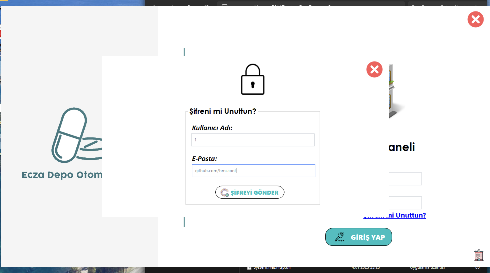

# Ecza Deposu Otomasyonu

Bu proje, bir ecza deposunun yönetimini ve otomasyonunu sağlamak amacıyla geliştirilmiştir.

## Özellikler

- Stok yönetimi
- Satış ve sipariş takibi
- Raporlama ve analiz

## Kurulum

! Öncelikle, yüklenilecek PC'de SQL Server kurulu olması gerekmektedir. Aksi halde uygulama çalışmayacaktır.

1. ".zip" uzantılı dosyanın içindeki klasörü dışarı çıkartıyoruz. 
2. Sonrasında şu adımları (`EczaDeposu_Otomasyonu\EczaDeposu_Setup\Debug`) izleyip `setup.exe` yi çalıştırıyoruz.
   
3. Yönergeleri takip edip kurulum işlemini tamamladıktan sonra önceden kurulmuş olan "SQL Server Management Studio" programını açıp
çıkan ibarede "Connect" sekmesine basmadan önce "Server name:" olan kutucuğun yanında yazan değerin tamamını kopyalayıp
"EczaDeposu_Otomasyonu" klasöründeki `Test.txt` olan metin belgesini açıp `Data Source=` kısmındaki `PC\\SQLEXPRESS` yazısının yerine
yapıştırıp kaydedip kapatıyoruz.
4. Ardından `Test.txt` dosyasını `C:\` dizinine yapıştırıyoruz. 
5. Aynı klasördeki `EczaDepoOtamsyonu` ve `EczaDepoOtamsyonu_log` dosyalarını şu adımı (`C:\Program Files\Microsoft SQL Server\MSSQL15.SQLEXPRESS\MSSQL\DATA`) izleyip klasörün içine seçtiğimiz iki dosyayı yapıştırıyoruz.

   

6. Son olarak "SQL Server Management Studio" programına tekrar dönüp "Connect" dedikten sonra sol üstte yer alan "Database" sekmesini
sağ tıklayıp `Attach...` dedikten sonra `Add...` kısmını seçip `EczaDepoOtomasyonu` dosyasını seçip ekliyoruz. İşlem tamamlandı.

   

## Kullanım

! Öncelikle, yüklenilecek PC'de SQL Server kurulu olması ve çalıştırılıp `Connect` butonuna basılıp bağlı olması gerekmektedir. Aksi halde uygulama çalışmayacaktır.

1. Kurulumdan sonra masaüstüne gelen kısayolu açıyoruz.
2. Çıkan "Kullanıcı Giriş Paneli" ekranında:
   - Kullanıcı Adı: `1`
   - Şifre: `1`
   
   şeklinde giriş yapabilir ve programı kullanmaya başlayabilirsiniz.

   

### Kontrol Paneli

Ana kontrol panelinden uygulamanın tüm özelliklerine erişebilirsiniz.

### Stok Ekleme

Yeni ürünleri stoklarınıza ekleyebilirsiniz.

### Stok Silme

Mevcut stoklarınızdan ürün silebilirsiniz.

### Stok Güncelleme

Mevcut stok bilgilerini güncelleyebilirsiniz.

### Stok Verileri Kontrolü

Stok verilerinizi kontrol edebilir ve detaylı bilgi alabilirsiniz.

### Satış Yapma

Ürünlerin satışını gerçekleştirebilirsiniz.

NOT: "Şifremi Unuttum" seçeneğinde "Kullanıcı Adı: `1`" girildikten sonra veritabanında `hamzaonat838@gmail.com` eklendiği için sadece o hesaba şifre gönderebilirsiniz. (güvenlik sebebiyle değiştirildi, VS'den `SifremiUnuttum.cs` den ilgili yerlere kullanan kişi kendi e-posta adresi ve e-posta şifresini girmeli.)
"SQL Server Management Studio" programı ile ise "Database"'e girip `EczaDepoOtomasyonu` sekmesini açıp `Tables` kısmından `dbo.giris` tablosunu bulup sağ tık yapıp `Edit Top 200 Rows` seçeneğini seçip `email` kısmını düzenleme yapıp kaydedebilirsiniz, veya yeni sorgu açıp uygun SQL komutları ile tabloyu düzenleyebilirsiniz.

   

## Lisans

Bu proje MIT Lisansı ile lisanslanmıştır. Daha fazla bilgi için `LICENSE` dosyasına bakın.
